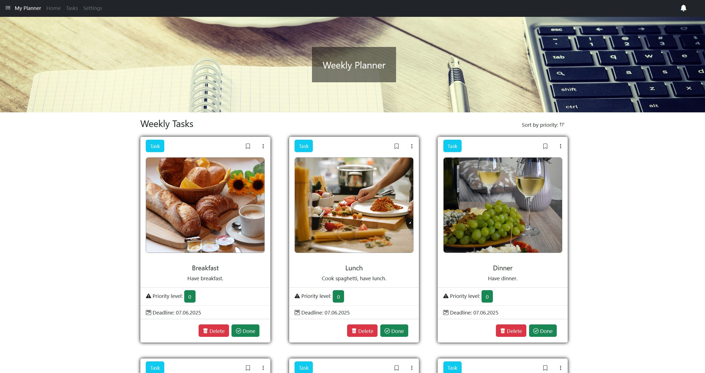
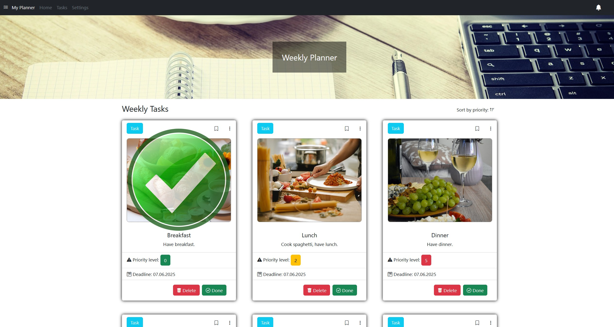
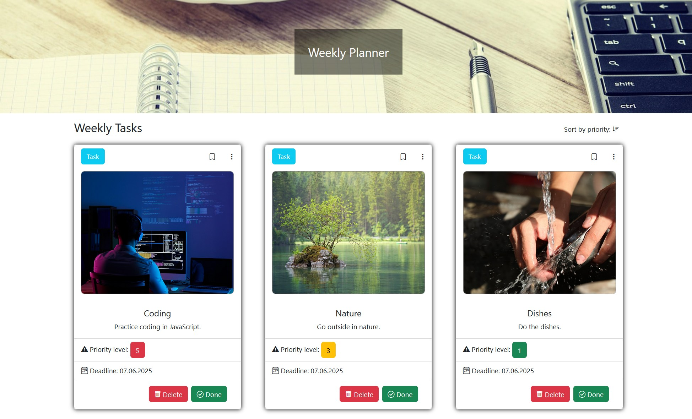
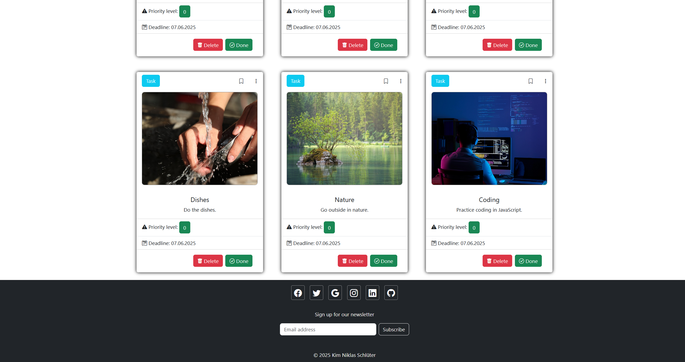

# Weekly Planner

A simple to-do list application built with vanilla JavaScript, focusing on core functionality and DOM manipulation.

## Screenshots

<table>
  <tr>
    <td colspan="2">
      
    </td>
  </tr>
  <tr>
    <td colspan="2">
      
    </td>
  </tr>
  <tr>
    <td colspan="2">
      
    </td>
  </tr>
  <tr>
    <td colspan="2">
      
    </td>
  </tr>
</table>
